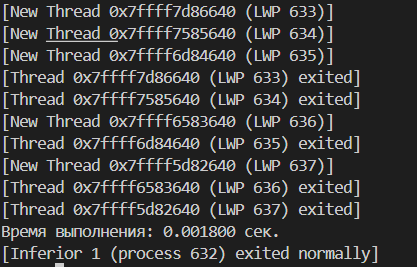
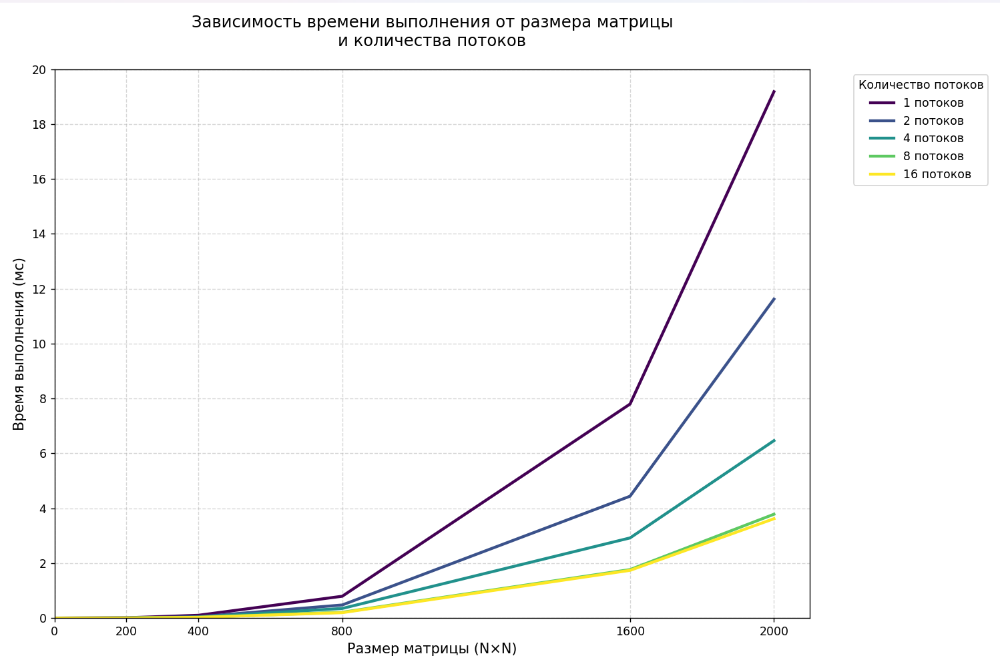

<!-- vscode-markdown-toc -->
* 1. [Лабораторная работа №7: Знакомство с POSIX потоками](#Лабораторная-работа-7-Знакомство-с-POSIX-потоками)
	* 1.1. [На оценку 3](#На-оценку-3)
		* 1.1.1. [Тема: Первое знакомство с pthread](#Тема-Первое-знакомство-с-pthread)
		* 1.1.2. [Цель работы](#Цель-работы)
		* 1.1.3. [Процесс](#Процесс)
	* 1.2. [На оценку 4](#На-оценку-4)
		* 1.2.1. [Тема: Перемножение матриц](#Тема-Перемножение-матриц)
		* 1.2.2. [Цель работы](#Цель-работы-1)
		* 1.2.3. [Процесс](#Процесс-1)
* 2. [Приложения](#Приложения)
	* 2.1. [Ссылка на программу:](#Ссылка-на-программу)

<!-- vscode-markdown-toc-config
	numbering=true
	autoSave=true
	/vscode-markdown-toc-config -->
<!-- /vscode-markdown-toc -->

# Лабораторная работа №7: Знакомство с POSIX потоками

**Выполнил:** Нгуен З.К.  
**Группа:** ИКС-433  
**Дата:** 04.05.25

---

## <a name='На-оценку-3'></a>На оценку 3

### <a name='Тема-Первое-знакомство-с-pthread'></a>Тема: Первое знакомство с pthread

### <a name='Цель-работы'></a>Цель работы:
- Создание потоков
- Ожидание потоков
- Добавление параметров потока
- Завершение потока без ожидания
- Вывод текста о завершении потока
- Создание простого Sleepsort

### <a name='Процесс'></a>Процесс:
1) Создаем поток с помощью pthread_create()
Родительский поток выводит текст после завершения дочернего потока

```c
void* thread_func(void* arg) {
    for(int i=0; i<5; i++) {
        printf("Дочерний поток: строка %d\n", i);
        sleep(1);
    }
    return NULL;
}

int main() {
    pthread_t thread;
    pthread_create(&thread, NULL, thread_func, NULL);
    pthread_join(thread, NULL);
    printf("Родительский поток завершен\n");
    return 0;
}
```


2) Задаем параметры потока
```c
void* thread_func_params(void* arg) {
    char** lines = (char**)arg;
    for (int i = 0; lines[i] != NULL; i++) {
        printf("%s\n", lines[i]);
        sleep(1); 
    }
    return NULL;
}
```
В main():
```c
char* lines1[] = {"Поток 1: строка 1", "Поток 1: строка 2", NULL};
    char* lines2[] = {"Поток 2: строка A", "Поток 2: строка B", NULL};
    pthread_t threads[4];
    pthread_create(&threads[0], NULL, thread_func_params, lines1);
    pthread_create(&threads[1], NULL, thread_func_params, lines2);
    pthread_join(threads[0], NULL);
    pthread_join(threads[1], NULL);
```


3) Дочерний поток перед завершением распечатывает сообщение
```c
void cleanup(void* arg) {
    printf("Поток завершается: %s\n", (char*)arg);
}
void* thread_func_cleanup(void* arg) {
    pthread_cleanup_push(cleanup, "Уборка перед отменой потока");
    while (1) {
        printf("Дочерний поток работает...\n");
        sleep(1);
    }
    pthread_cleanup_pop(0);
    return NULL;
}
```
В main():
```c
 pthread_create(&thread, NULL, thread_func_cleanup, NULL);
    sleep(2); 
    pthread_cancel(thread); 
    pthread_join(thread, NULL);
```


4) Создание Sleepsort
```c
void* sleepsort(void* arg) {
    int val = *(int*)arg;
    sleep(val);
    printf("%d ", val);
    return NULL;
}
```
В main():
```c
int arr[] = {3, 1, 4, 2};
    int n = sizeof(arr) / sizeof(arr[0]);
    pthread_t sleep_threads[n];
    printf("\nSleepsort: ");
    for (int i = 0; i < n; i++) {
        pthread_create(&sleep_threads[i], NULL, sleepsort, &arr[i]);
    }
    for (int i = 0; i < n; i++) {
        pthread_join(sleep_threads[i], NULL);
    }
    printf("\n");

    return 0;
```


---

<a name='На-оценку-4'></a>На оценку 4
<a name='Тема-Перемножение-матриц'></a>Тема: Перемножение матриц
<a name='Цель-работы-1'></a>Цель работы:
- Синхронизирование вывода
- Перемножение квадратных матриц NxN
- Замеры времени выполнения (с момента создания потоков и до завершения работы потоков)
- Построение графика в python

<a name='Процесс-1'></a>Процесс:

1) Перемножение матриц в функции multiply
```c
void* multiply(void* arg) {
    ThreadData* data = (ThreadData*)arg;
    for (int i = data->start_row; i < data->end_row; i++) {
        for (int j = 0; j < N; j++) {
            C[i][j] = 0;
            for (int k = 0; k < N; k++) {
                C[i][j] += A[i][k] * B[k][j]; 
            }
        }
    }
    return NULL;
}
```
2) Замер времени выполнения программы
```c
    clock_t start = clock();

    int current_row = 0;
    for (int i = 0; i < actual_threads; i++) {
        thread_data[i].start_row = current_row;
        thread_data[i].end_row = current_row + rows_per_thread + (i < remaining_rows ? 1 : 0);
        thread_data[i].thread_id = i;
        
        if (pthread_create(&threads[i], NULL, multiply, &thread_data[i]) != 0) {
            fprintf(stderr, "Ошибка создания потока %d\n", i);
            actual_threads = i;  
            break;
        }
        
        current_row = thread_data[i].end_row;
    }

    for (int i = 0; i < actual_threads; i++) {
        pthread_join(threads[i], NULL);
    }

    clock_t end = clock();
    double time_spent = (double)(end - start) / CLOCKS_PER_SEC;
```
3) Синхронизированный вывод c помощью mutex
```c
pthread_mutex_t mutex = PTHREAD_MUTEX_INITIALIZER;
pthread_cond_t cond = PTHREAD_COND_INITIALIZER;
int current_turn = 0;
//...
pthread_mutex_lock(&mutex);
while (current_turn != 0) {
    pthread_cond_wait(&cond, &mutex);
}
printf("Основной поток: обработал строку %d\n", row);
current_turn = (current_turn + 1) % (actual_threads + 1);
pthread_cond_broadcast(&cond);
pthread_mutex_unlock(&mutex);
```



<a name='Приложения'></a>Приложения

4) Вывод графика Зависимости времени выполнения от размера матрицы и количества потоков на Python.


Обьяснение:
1) Тратиться много времени на создание потоков, каждый поток требует времени на его создание и закрытие
2) Невыгодное распределение работы между потоками:
Чем меньше количества элементов в матрице, и чем больше потоков, тем медленне работает программа.
Пример: при N =100 и 16 потоков, каждый поток обрабатывает 6-7 строк

<a name='Ссылка-на-программу'></a>Ссылка на программу:

[График](https://github.com/Darkness1853/programming-Python/blob/669e6bce4231aee4a7645d86178b3f7f946059dd/other/project/graph)
---
